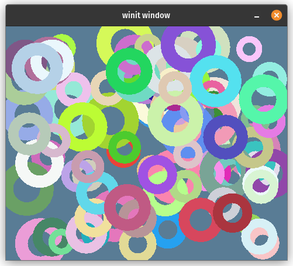
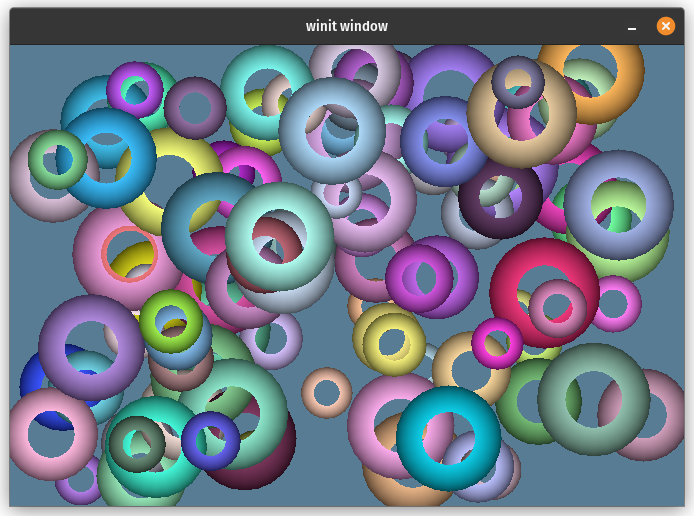

# WebGPU Fundamentals

IMPORTANT: The following are **verbatim** notes taken from the [WebGPU Fundamentals](https://webgpufundamentals.org)
websites for quick access. 
All credits are theirs.
Please head [there](https://webgpufundamentals.org) for the complete material.

## Fundamentals

## Inter-stage variables

Inter-stage variables come into play between a vertex shader and a fragment shader:
When a vertex shader outputs 3 positions, a triangle gets rasterized.
The vertex shader can output extra values **at each of those positions** and
by default, those values will be interpolated between the 3 points.

Inter-stage variables are most often used to interpolate texture coordinates
across a triangle, or normal directions.

IMPORTANT: the connection between the vertex shader and the fragment shader 
is **by index**. For inter-stage variables, they connect by `@location` index.

`@builtin` are **NOT** inter-stage variable, it's a... `@builtin`. 
It happens that `@builtin(position)` has a different meaning in a vertex shader 
vs in a fragment shader:
- in a vertex shader `@builtin(position)` is the output of the fragment shader in
  [clip space](https://www.w3.org/TR/webgpu/#coordinate-systems).
- in a fragment shader `@builtin(position)` is an input: it's the pixel coordinates
  in [framebuffer coordinates](https://www.w3.org/TR/webgpu/#coordinate-systems) 
  of the pixel the fragment shader is currently being asked to compute the color for.

TL/DR: 
- `@builtin(position)` in vertex shader and fragment shader are unrelated: they
are completely different variables.
- for inter-stage variables, all that matters are the `@location(n)` annotated variables/struct fields.

## Uniforms

Uniforms are kinda like global variables for your shaders: you set their values
before you execute the shader and they'll have those values for every iteration of the shader.

We start with 1 buffer with one object (color, scale and offset) per shape (part1).

In part 2, we draw multiple shapes. We create 1 bind group with 1 buffer containing 1 object (color, scale and offset) per shape.
During rendering, for each object, we update the corresponding buffer, set the bind group on the render pass, 
and issue a draw call. Then submit the command buffer.

In part 3, we split the buffer into 2 uniform buffers per object to draw: one static one containing values
computing before rendering, and a dynamic one whose value are computed at render time.

When splitting our buffer, we run into a memory alignment issue for the first time, that is solved 
by adding padding.
- [webgpu memory layout](https://webgpufundamentals.org/webgpu/lessons/webgpu-memory-layout.html)
- [webgup alignment and size spec](https://www.w3.org/TR/WGSL/#alignment-and-size)
- [Shader Buffer Memory Layout Info](https://gist.github.com/teoxoy/936891c16c2a3d1c3c5e7204ac6cd76c)

## Storage Buffers

In part 1 we simply change our uniform buffers into storage buffer, and see that it just works the same.

So what's the difference ? And why we need these 2 types of buffers ?
- Uniform buffers can be faster for their typical use-case, i.e. passing properties for an object,
- Storage buffers can be much bigger (uniform min max size is 64k, storage buffer min max size is 128m)
- Storage buffers can be read/write, uniform buffers are read only.

In part 2, we explore *instancing* with storage buffers.
We create one storage buffer to store a color and the offset of each triangle *instance*, and another buffer
to store the scales (x and y). This last buffer is fill in at render time.

Also we issue a **single** draw call (with 100 instance) instead of 100 draw calls with a single instance in 
uniform case (uniform part 3). An instance is like an **outer loop iteration**: for each instance, the draw call
is going to execute the vertex shader once for each vertex (inner loop).

In part 2, we indexed the storage buffer using the *instance_index*. 

In part 3, we use a storage buffer to store vertex data, and use the *vertex_index* to index that buffer.
We draw many colorful instances of circle: vertices for a **single*** circle are stored in storage buffer
(indexed using the vertex_index in the vertex shader) whereas color and scale for each instance is drawn 
from the uniform buffers indexed using the instance_index.

Along the way, we refactor a bit to try to separate the resources required for a view and those required to draw
some content.

## Vertex Buffers

Although passing vertex data in storage buffers is getting more popular, the *traditional way* is to use 
vertex buffer which are similar to storage buffers but offer a *higher level* API: 
- the data stored in a Vertex buffer is described using attributes and 
  data is pulled out of the buffer and handed over to the vertex shader directly,
- Attributes describe the shader location (`@location(0)`), the start offset in the buffer, and the format (`float32x2`).

Also vertex buffers are not part of a bind group, instead they must be *declared* in the vertex stage of a render pipeline
and set on a render pass (`pass.setVertexBuffer(vbuff)`).

In part 1, we use a vertex buffer to store our circle vertices. These are reused for each instance.

In part2, we store per instance color and offset into a 2nd vertex buffer, and per instance scales in a 3rd. 
Both these buffers use a **per instance step mode**.

In part 3, we add a per vertex color.

